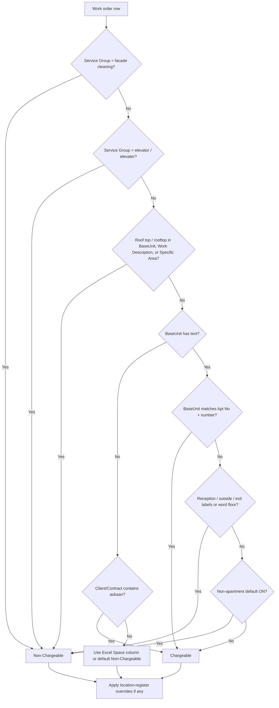

# Askaan / Saqr — Chargeable vs Non-Chargeable Policy

This document explains **how we decide whether a work order is billable (Chargeable) or not billable (Non-Chargeable)** for the **Askaan + Saqr Projects** portfolio in Injaaz MMR (Monthly Maintenance Report) reporting.

It is written for operations, finance, and admin users. For the full technical rule engine shared across all MMR clients, see [`module_mmr/CHARGEABLE_RULES.md`](../module_mmr/CHARGEABLE_RULES.md).

---

## 1. Scope

| In scope | Out of scope |
|----------|--------------|
| Reactive work orders from CAFM exports where **Client** or **Contract** mentions **Askaan** or **Saqr** | Other tower portfolios (Orient, Garden City, Ajman Municipality, C1) — see the general MMR chargeable doc |
| Classification shown in MMR dashboard **Space** column, Excel reports, and scheduled emails | Contract pricing, invoicing amounts, or client sign-off outside Injaaz |
| Rules configured under **Admin → MMR → Report settings** (`/admin/mmr-chargeable`) | Ticketing module chargeable badges (separate field) |

In reports and emails, all matching rows are grouped under the single project label **Askaan + Saqr Projects**, even when CAFM uses multiple contracts for Askaan and Saqr sites.

---

## 2. Business principle

For Askaan / Saqr, billing follows the same CAFM-aligned default used across MMR:

> **Only apartment units are chargeable. Common areas and shared facilities are non-chargeable.**

In practice:

- **Chargeable** — Work tied to a specific apartment (e.g. `Apt No 911`, `Apt No 1205`).
- **Non-Chargeable** — Lobbies, parking, CCTV rooms, plant rooms, reception, floors, roof areas, facade cleaning, elevators, and other shared or landlord-scope locations.

This matches how CAFM location registers are structured: apartment Base Units bill; everything else does not, unless explicitly overridden.

---

## 3. Data the system reads

Each work order row uses these CAFM / Excel fields:

| Field | Role for Askaan / Saqr |
|-------|------------------------|
| **BaseUnit** | Primary location label — drives most decisions when filled in |
| **Service Group** | Service type (facade, elevator, plumbing, etc.) |
| **Client** / **Contract** | Identifies the project; used when BaseUnit is empty |
| **Work Description** | Scanned for roof-top wording |
| **Specific Area** | Optional; also scanned for roof-top wording |
| **Space** | Original Excel billing flag — used only when BaseUnit is empty and the Askaan empty-BaseUnit default does not apply |

The resolved result is always **Chargeable** or **Non-Chargeable** and appears as the **Space** value on the MMR dashboard and in generated reports.

---

## 4. Decision order (first match wins)

Rules are evaluated **top to bottom**. Once a rule applies, later rules are skipped for that row.

### Step-by-step summary

| Step | Condition | Result |
|------|-----------|--------|
| 1 | **Service Group** contains *facade cleaning* | **Non-Chargeable** |
| 2 | **Service Group** is elevator / elevater (CAFM typo) | **Non-Chargeable** |
| 3 | **BaseUnit**, **Work Description**, or **Specific Area** mentions roof top / rooftop | **Non-Chargeable** |
| 4 | **BaseUnit** matches **Apt No** + at least one digit (e.g. `Apt No 305`) | **Chargeable** |
| 5 | **BaseUnit** contains reception, outside, exit/entry labels, or the word *floor* | **Non-Chargeable** |
| 6 | **BaseUnit** is any other non-empty text, and *Only apartments bill as Chargeable* is **on** (default) | **Non-Chargeable** |
| 7 | **BaseUnit** is empty and **Client** or **Contract** contains **askaan** | **Chargeable** |
| 8 | **BaseUnit** is empty otherwise | Use Excel **Space** (with typo correction); blank or unknown → **Non-Chargeable** |
| 9 | After core rules | **Location register** per-row toggles may override (longest BaseUnit match wins) |

---

## 5. Rules that apply to Askaan / Saqr

### 5.1 Always non-chargeable (service type)

| Trigger | Examples |
|---------|----------|
| Facade cleaning | Service Group contains “Facade Cleaning” |
| Elevator works | “Elevator system”, “Elevater system” (CAFM spelling) |
| Roof areas | Specific Area = “Roof Top”, or description mentions “roof top” / “rooftop” |

These apply regardless of BaseUnit or apartment pattern.

### 5.2 Chargeable — apartments

| Pattern | Examples |
|---------|----------|
| `Apt` + `No` + digits (flexible spacing, case-insensitive) | `Apt No 911`, `apt no 12`, `AptNo 305` |

Apartment classification is evaluated **before** reception/floor rules, so an apartment label stays chargeable even if other wording appears in the same cell.

### 5.3 Non-chargeable — common-area BaseUnit labels

When the row is **not** an apartment pattern, BaseUnit is checked for:

| BaseUnit contains | Result |
|-------------------|--------|
| reception | Non-Chargeable |
| outside / out side | Non-Chargeable |
| exit and entry (together) | Non-Chargeable |
| exit/ or exit / | Non-Chargeable |
| floor (e.g. “10th Floor”) | Non-Chargeable |

### 5.4 Non-chargeable — all other non-apartment BaseUnits (default)

When **Only apartments bill as Chargeable** is enabled (recommended default in Report settings):

| BaseUnit example | Result |
|------------------|--------|
| Lobby | Non-Chargeable |
| Parking | Non-Chargeable |
| CCTV Room | Non-Chargeable |
| GYM Equipment | Non-Chargeable |
| Lift Area | Non-Chargeable |

If that toggle is turned **off** (legacy mode), these locations would resolve to **Chargeable** instead.

### 5.5 Empty BaseUnit — Askaan default

When CAFM leaves **BaseUnit** blank:

| Client / Contract contains | Result |
|----------------------------|--------|
| **askaan** | **Chargeable** |
| **saqr** only (no “askaan” in Client or Contract) | Excel **Space** column is used; blank/unknown → **Non-Chargeable** |

**Note:** Saqr rows are included in the **Askaan + Saqr Projects** report grouping, but only **askaan** triggers the empty-BaseUnit chargeable default. Saqr-only contracts should have correct **Space** values in the CAFM export when BaseUnit is missing.

---

## 6. Rules that do **not** apply to Askaan / Saqr

These exist for other estates and are **ignored** for Askaan / Saqr work orders:

| Rule | Applies to |
|------|------------|
| Garden City + AC/HVAC → Non-Chargeable | Garden City only |
| Garden City apartment HVAC carve-out | Garden City only |
| Ajman Municipality workbook **Space** authority | Ajman Municipality contracts only |

Askaan / Saqr apartment HVAC or AC work in an `Apt No …` unit remains **Chargeable** under the standard apartment rule.

---

## 7. Location register (per-site overrides)

Admins can upload a **Location Register** (Excel/HTML export from CAFM) in **Report settings** and toggle chargeable status per BaseUnit row.

| Aspect | Behaviour |
|--------|-----------|
| Purpose | Fine-tune individual locations (e.g. mark a specific plant room, or reclassify an edge case) |
| Apartments | Always treated as chargeable in the register UI; not overridden |
| Non-apartments | Each row can be set Chargeable or Non-Chargeable |
| Effect | Saved toggles become **substring overrides** (longest BaseUnit match wins) |
| Persistence | Stored in MMR chargeable config; applies immediately to uploads, dashboard, Excel, and email |

Use the register when the global rules are correct for most rows but specific BaseUnits need an exception agreed with finance or the client.

---

## 8. Worked examples (Askaan / Saqr)

| BaseUnit | Service Group | Client / Contract | Resolved |
|----------|---------------|-------------------|----------|
| Apt No 1204 | Plumbing | Askaan Tower | **Chargeable** |
| Lobby | Cleaning | Saqr Building | **Non-Chargeable** |
| Parking Level B1 | Electrical | Askaan + Saqr FM | **Non-Chargeable** |
| Reception | HVAC | Askaan | **Non-Chargeable** |
| 15th Floor | Civil | Saqr | **Non-Chargeable** |
| *(empty)* | Plumbing | Askaan Contract | **Chargeable** |
| *(empty)* | Plumbing | Saqr Contract *(no “askaan”)* | **Space** column, or Non-Chargeable if blank |
| Plant Room | Elevator system | Askaan | **Non-Chargeable** (elevator rule, step 2) |
| Apt No 502 | Facade cleaning | Askaan | **Non-Chargeable** (facade rule, step 1) |
| Roof Top | Electrical | Saqr | **Non-Chargeable** (roof rule, step 3) |

---

## 9. Where results appear

The same classification is used everywhere MMR chargeable logic runs:

| Output | What you see |
|--------|--------------|
| MMR dashboard | **Space** column; Chargeable vs Non-Chargeable KPIs and charts |
| Excel report | **Space** column on work-order sheets |
| **Chargeable by Project** sheet | Askaan + Saqr chargeable breakdown by Service Group (Resolved / Pending) |
| Scheduled / manual MMR email | Per-tower HTML tables for chargeable work orders |

Only rows resolved as **Chargeable** count toward Askaan + Saqr chargeable totals in project-level summaries.

---

## 10. Configuration and ownership

| Item | Location | Owner |
|------|----------|-------|
| Global on/off rules (facade, elevator, apartment default, etc.) | Admin → **Report settings** (`/admin/mmr-chargeable`) | MMR admin |
| Location register upload and per-row toggles | Same page — **Location register** section | MMR admin + operations |
| Rule changes in code | `module_mmr/mmr_service.py` — `_resolve_chargeable()` | Development |

**Recommended default for Askaan / Saqr:** keep **Only apartments bill as Chargeable** **on**, upload the current CAFM location register, and review overrides when new zones or BaseUnits are added in CAFM.

When business rules change:

1. Agree the policy with finance / client (this document).
2. Update Report settings and/or location register in Injaaz.
3. If logic must change in code, update `mmr_service.py` and align [`CHARGEABLE_RULES.md`](../module_mmr/CHARGEABLE_RULES.md).

---

## 11. Quick reference card

| Situation | Typical result |
|-----------|----------------|
| Apartment (`Apt No` + number) | **Chargeable** |
| Lobby, parking, plant, gym, CCTV, etc. | **Non-Chargeable** |
| Reception, outside, floor labels | **Non-Chargeable** |
| Facade cleaning | **Non-Chargeable** |
| Elevator / elevater works | **Non-Chargeable** |
| Roof top / rooftop | **Non-Chargeable** |
| Empty BaseUnit + **askaan** in Client/Contract | **Chargeable** |
| Empty BaseUnit + **saqr** only | Excel **Space**, else **Non-Chargeable** |
| Location register override saved for that BaseUnit | Override wins (unless locked by facade/elevator/roof/apartment rules) |

---

## 12. Related documentation

| Document | Contents |
|----------|----------|
| [`module_mmr/CHARGEABLE_RULES.md`](../module_mmr/CHARGEABLE_RULES.md) | Full MMR rule engine (all clients) |
| [`docs/APPLICATION_OVERVIEW.md`](APPLICATION_OVERVIEW.md) | Injaaz modules overview |
| Admin UI | `/admin/mmr-chargeable` — live preview and location register |

---

*Last aligned with `module_mmr/mmr_service.py` chargeable resolver. Update this document when Askaan / Saqr billing policy or admin defaults change.*
