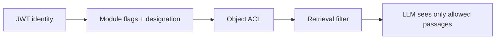
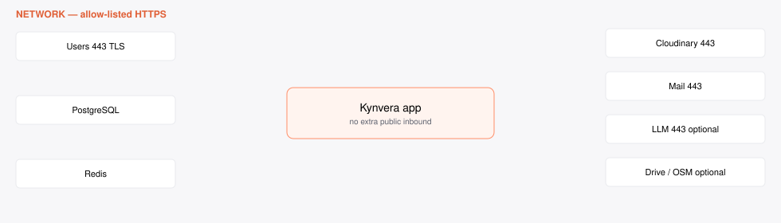

# Agent Connectivity, Permissions & Attributes

**Kynvera · Injaaz FM Operations Platform**

**PDF (for IT):** [Agent_Connectivity_Permissions_Attributes.pdf](Agent_Connectivity_Permissions_Attributes.pdf)

Companion documents: [IT Clarification Answer Matrix](IT_Clarification_Answer_Matrix.md) · [Architecture Deck](Architecture_Deck.md)

Diagram artifacts: [architecture stack](artifacts/architecture-stack.svg) · [network](artifacts/network-connectivity.svg)

---

## Purpose

This document is for **IT and security review**. It describes what Kynvera connects to, what **Ask Kynvera** (the in-app assistant) may read and propose, and the **least-privilege** permissions for optional Google Drive, email, and object storage.

The product is **not** a Microsoft 365 tenant agent and **does not** request Global Admin, `Sites.Read.All`, `Mail.Send`, or WhatsApp.

Design principles:

- **No full-tenant access** to Google or Microsoft.
- **No automatic email send** from the assistant.
- **No automatic ticket close, form approve, or payroll change.**
- Scaling adds **users and projects you assign** — not a wider cloud grant.

---

## Access model

Kynvera users authenticate to **this application** (username/email + password → JWT access + refresh tokens, HTTP-only cookies for browser navigation). Identity is **not** delegated Microsoft Graph.

Two layers:

1. **Application RBAC (authoritative)**  
   `User.role` (`admin` / `user`), workflow `designation` (supervisor, operations manager, business development, procurement, general manager, HR manager, …), and boolean module flags (`access_hvac`, `access_civil`, `access_cleaning`, `access_hr`, `access_procurement_module`, `access_business_development`, `access_quotations`, `access_sales_manager`, `access_report_generation`, `access_submitted_forms`, `access_ticketing`, `access_qhsi`, `access_files`, …). Admins bypass module checks.

2. **Object-level rules**  
   Tickets: reporter / assignee / technician / supervisor / project roster — not “all tickets because you have the module.” DocHub: optional per-user allow row. Files: `access_files` or HR (for HR-fed folders). Drive: each user connects **their own** Google account.

**Delegated analogue:** Ask Kynvera always runs **as the signed-in JWT user**. Tools ignore any client-supplied `user_id`. An admin-only profile lookup by `person_name` is the sole exception, and still does not grant ticket or HR write on that person.

Background jobs (MMR email, HR Excel automation, report workers) use **server configuration**, not a user’s Google token, except Drive sync which uses the connecting user’s stored OAuth refresh token.

Your administrators grant, narrow, or revoke module flags and designations in **Administration**. Revoking a flag immediately stops new UI and tool access for that module.

---

## Product capabilities (the “workforce”)

Kynvera is a **modular operations platform** with one assistant on top — not eight unattended tender bots. Each capability below is a **role-scoped module** with human supervision.

| Capability | What it does | Human gate |
|------------|--------------|------------|
| **Ask Kynvera** | Grounded Q&A and confirm-before-write drafts | User Confirm on writes |
| **AI ticket triage** | Suggests priority, SLA hours, technician, parts | Supervisor confirm / override |
| **Inspections** (HVAC/MEP, Civil, Cleaning) | Site forms, photos, signatures, PDF/Excel | Reviewer sign-off |
| **Ticketing** | Work orders, SLA, costs, email intake drafts | Supervisor convert / close |
| **Assets / GIS / twin** | Registry, QR, map pins, 2D floor plans, RUL *estimates* | Admin/FM maintain master data |
| **HR** | Leave and workforce forms, trackers, DOCX/PDF | HR → GM chain |
| **Procurement** | Materials, PRs, suppliers | Threshold / GM rules |
| **MMR** | CAFM Excel in → chargeable analytics → scheduled mail | Recipients you configure |
| **DocHub** | Controlled documents | Admin publish / access list |
| **Files** | In-app folders; optional Drive sync | User OAuth consent |
| **QHSI** | Quality, hospitality, safety, inspections hub | Module flag |
| **Business development** | Pipeline, quotations, notifications | BD / sales flags |

---

## Ask Kynvera — connectivity matrix

Every tool executes **server-side** with the JWT user. Write tools **do not mutate** tickets or forms in the chat request; they insert `AssistantPendingAction` until Confirm.

Legend: **R** = read, **P** = propose only (no save until Confirm)

| Tool | Kind | Connected system | Reads | Writes / creates | Attributes touched | Required access |
|------|------|------------------|-------|------------------|--------------------|-----------------|
| `get_pending_forms` | R | PostgreSQL `submissions` | Pending workflow items for this reviewer | — | submission id, module, site, status | Reviewer designation or admin |
| `get_my_leave` | R | Submissions (`hr_leave*`) | Own leave applications | — | type, dates, status | Signed-in user (own rows) |
| `get_my_tickets` | R | `tickets` | Tickets user raised or is assigned | — | counts, ids, status | `access_ticketing` or admin |
| `get_my_profile` | R | `users` | Own profile; admin may pass `person_name` | — | name, title, leave balance, manager | Self; other people = admin |
| `search_documents` | R | DocHub | Published docs user may access | — | title, category, links | DocHub access |
| `search_knowledge` | R | FAQ + admin knowledge + permitted DocHub | Passages for RAG | — | title, source, excerpt | Any authenticated user (DocHub subset filtered) |
| `get_fm_critical_assets` | R | `fm_assets` | Critical / low health assets | — | asset id, name, building, score | `access_ticketing` or admin |
| `get_fm_failures_by_building` | R | Tickets + assets | Failure counts by building | — | building, counts | `access_ticketing` or admin |
| `get_fm_cost_trend` | R | Tickets + assets | Month vs prior costs | — | cost totals, ticket counts | `access_ticketing` or admin |
| `get_fm_maintenance_report_hint` | R | Config / links | How to generate MMR | — | URLs, month label | Ticketing **or** `access_report_generation` |
| `get_my_submissions` | R | Submissions | Own form counts | — | draft / in-progress / done | Signed-in user |
| `get_my_inspections` | R | HVAC/civil/cleaning submissions | Own inspections | — | module, status | Signed-in user |
| `propose_create_ticket` | P | Pending action store | Prefill from chat | Draft ticket **after Confirm** | title, description, project, property, zone, priority | `access_ticketing` or admin |
| `propose_leave_draft` | P | Pending action store | Prefill | HR leave **draft** after Confirm — **not submitted** | leave type, dates, reason | Authenticated user with HR path |

**Explicitly out of scope for the assistant**

- Approve / reject workflow
- Close or reassign tickets (except suggesting triage for a human)
- Send Outlook/Gmail
- Read or write Google Drive
- Change payroll, visas, or user passwords
- Read another user’s tickets or leave (except admin profile lookup)
- Unrestricted “ask the model about the whole database”

Pending actions expire after **15 minutes**. Confirm is logged via application audit patterns.

---

## AI ticket triage (separate from chat tools)

| Item | Detail |
|------|--------|
| Endpoint | `POST /tickets/api/tickets/triage-preview` then `triage-confirm` |
| Method | Structured JSON from the configured LLM (`generate_structured`) |
| Inputs | Title, description, location, optional asset history, technician roster |
| Outputs | `priority`, `sla_hours` (1–72), `technician_id` or null, `required_parts`, `reasoning` |
| Persistence | `TicketTriageLog` (inputs, raw response, human decision) |
| Apply | **Never auto-applied** on preview |

---

## Platform integrations — systems, APIs, attributes

These are **application integrations**, not per-chat-tool Graph grants.

| Integration | API / method | Reads | Writes | Required configuration | Required? |
|------------|--------------|-------|--------|------------------------|-----------|
| **PostgreSQL** | SQLAlchemy | All operational data | All module writes | `DATABASE_URL` | Yes (production) |
| **Redis** | Redis protocol | Rate-limit counters | Counters / jobs | `REDIS_URL` | Strongly recommended |
| **Cloudinary** | HTTPS REST / unsigned preset | — | Images, signatures, DocHub files | `CLOUDINARY_*` | Yes in production validator |
| **Mail outbound** | Mailjet HTTPS, Brevo HTTPS, or SMTP | — | Transactional mail (reset, workflow, MMR) | Mailjet/Brevo/SMTP + `MAIL_DEFAULT_SENDER` | When email is needed |
| **Mail inbound tickets** | Mailjet Parse → webhook | Email subject/body/attachments | Draft `Ticket` + `TicketEmailIntake` | `TICKET_INBOUND_WEBHOOK_SECRET`, MX | Optional |
| **Google Drive** | OAuth 2 + Drive API v3 | Files in app-created tree | Upload/sync under **Kynvera Files** | `GOOGLE_DRIVE_*` + user consent | Optional |
| **LLM** | Anthropic Messages or OpenAI-compatible chat | Prompt + tool results | — (inference only) | `ANTHROPIC_API_KEY` or `OPENAI_API_KEY` | Optional (assistant/triage/predictions) |
| **Nominatim (OSM)** | HTTPS geocode | Address → lat/lng | — | Public API; use sparingly | Optional (ticket map) |
| **Leaflet / OSM tiles** | Browser HTTPS | Map tiles | — | CDN (unpkg) for GIS page | Optional (asset map UI) |

---

## Google OAuth — least privilege (Files module)

Used **only** if `GOOGLE_DRIVE_ENABLED=true` and the user clicks Connect.

| Scope | Why | Not requested |
|-------|-----|----------------|
| `https://www.googleapis.com/auth/drive.file` | Create/read/update files **this app** created (root folder **Kynvera Files**, legacy **Injaaz Files**) | `drive`, `drive.readonly` (full Drive) |
| `https://www.googleapis.com/auth/userinfo.email` | Show which Google account is connected | Contacts, Gmail |
| `openid` | Standard sign-in to Google for this link | Calendar, Docs-wide |

Revoke: user disconnects in Files, or Google Account → third-party access. IT can disable the feature with `GOOGLE_DRIVE_ENABLED=false`.

**Microsoft Graph:** not used. No `Sites.Selected`, no `Mail.ReadWrite`, no Teams RSC.

---

## Network connectivity (ports and protocols)

No inbound ports from the public internet are required **except** the HTTPS listener you already expose for users (and, if used, the Mailjet webhook).

| Flow | Direction | Port / protocol | Purpose | Required |
|------|-----------|----------------|---------|----------|
| Users / admin / PWA / Capacitor | Inbound to reverse proxy | 443 / TLS | App UI and APIs | Yes — typically Nginx/Render, not raw Flask public |
| PostgreSQL | App → DB | 5432 (or provider) | Data | Yes |
| Redis | App → Redis | 6379 / TLS (`rediss`) | Limits / queue | Recommended |
| Cloudinary | Outbound | 443 / HTTPS | Media | Production |
| Mailjet / Brevo API | Outbound | 443 / HTTPS | Mail | If email enabled |
| SMTP (alternative) | Outbound | 587 / STARTTLS | Mail | If SMTP path chosen |
| Anthropic / OpenAI / compatible LLM | Outbound | 443 / HTTPS | Assistant, triage, predictions | Only if LLM enabled |
| Google OAuth + Drive | Outbound | 443 / HTTPS | Files sync | Only if Drive enabled |
| Nominatim | Outbound | 443 / HTTPS | Geocode | Only if geocode used |
| OS / pip / container updates | Outbound | 443 / HTTPS | Patch channel | Standard |
| App ↔ Postgres ↔ Redis | Internal | Internal network | Orchestration, logs | Inside boundary |

**Firewall allow-list (typical outbound hostnames)** — confirm exact hosts at deploy time:

- Your Cloudinary cloud
- `api.anthropic.com` **or** `api.openai.com` **or** your `ASSISTANT_LLM_BASE_URL`
- Mailjet / Brevo API hosts (or your SMTP relay)
- `accounts.google.com`, `oauth2.googleapis.com`, `www.googleapis.com` (Drive only)
- `nominatim.openstreetmap.org` (geocode only)

In **LLM-off** mode, the only *new* egress versus a static website is Cloudinary + email (and Drive if enabled).

---

## Role-based access control (illustrative)

Mapped to **Kynvera designations and flags**, not Entra groups (unless you later add SSO).

| Role / designation | Typical modules | Tickets | Pricing / markup | Assistant writes | Admin panel |
|-------------------|-----------------|---------|------------------|------------------|-------------|
| **Field / user** (module flags only) | Assigned inspection/HR flags | Own raised / assigned | None | Ticket draft if `access_ticketing`; leave draft | — |
| **Supervisor** | Pending review + ticketing | Roster / team tickets; email drafts | Markup on close | Same as flags | — |
| **Operations manager** | Ops + reviews | Broad ops visibility (as configured) | Ops close path | Per flags | — |
| **Procurement** | Procurement module | As flagged | Catalogue / PR prices | No commercial assistant tool | — |
| **Business development** | BD, quotations as flagged | Inspection BD lane | Quotations module | Per flags | — |
| **HR / HR manager** | HR | — | — | Leave draft (own) | HR tools |
| **General manager** | Reviews / HR GM | As configured | Approvals | Per flags | — |
| **Administrator** | All | All | Config | Profile lookup others; all tools allowed by code paths | Yes |
| **IT (app admin, no FM content)** | Users, devices, knowledge | None unless flags granted | None by default | Can be locked to admin UX only | Yes |

**Retrieval-level rule:** FM cost/failure tools return `allowed: false` without ticketing access — those numbers are **not** placed in the prompt.

**Ticket ACL:** having `access_ticketing` does not mean every ticket. Visibility is reporter, assignee, technician, supervisor, or supervised project.

---

## Audit and traceability

| Event | Where |
|-------|--------|
| Login / logout / user admin | `audit_logs` |
| Workflow transitions | Workflow + `audit_logs` where wired |
| Email intake (success, duplicate, fail) | `ticket_email_intakes` |
| AI triage | `ticket_triage_logs` |
| Assistant proposals | `assistant_pending_actions` + confirm route |
| Asset AI estimates | `fm_asset_predictions` (`method` field) |

Assistant replies that use knowledge include **source titles** from FAQ/DocHub chunks. Ticket IDs in answers must come from tools.

---

## Human approval controls

- Outlook/Gmail: **not sent by the assistant**. Application mail is server-side for password reset, workflow, MMR, intake notifications — configured by IT.
- Ticket from chat: **draft after Confirm**, then supervisor workflow.
- Leave from chat: **draft only**; user must open the HR form to sign and submit.
- Email-intake tickets stay **draft** until a supervisor converts them.
- Drive: **user** consents; IT can disable the feature.

---

## Boundaries — never requested or accessed

- Microsoft Global Admin, Graph `Sites.Read.All` / `Sites.FullControl.All`, `Mail.Send`
- Google `drive` (full) or Gmail scopes
- WhatsApp Business or personal WhatsApp
- Production payroll / bank files
- Unrestricted LLM access to the database
- Automatic tender or client portal submission

---

## Security review notes

Review together with:

- [Architecture Deck](Architecture_Deck.md) (trust boundary, data flows)
- [IT Clarification Answer Matrix](IT_Clarification_Answer_Matrix.md)
- Deployment model (Render, OCI, Docker) and `docs/PRODUCTION_DEPENDENCIES_CHECKLIST.md`
- Your VAPT / internal checklist

Current engineering evidence: secure SDLC, hashed passwords, JWT revocation, rate limits, security headers, least-privilege Drive scopes, confirm-before-write assistant, ticket ACL. Pen-test reports are produced under **your** go-live process if required.

---

*Kynvera · Injaaz Facilities Management · Least privilege, human in the loop.*
