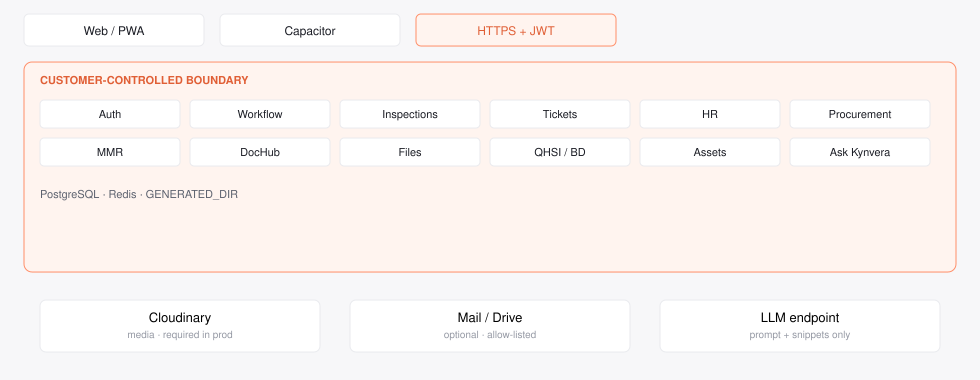
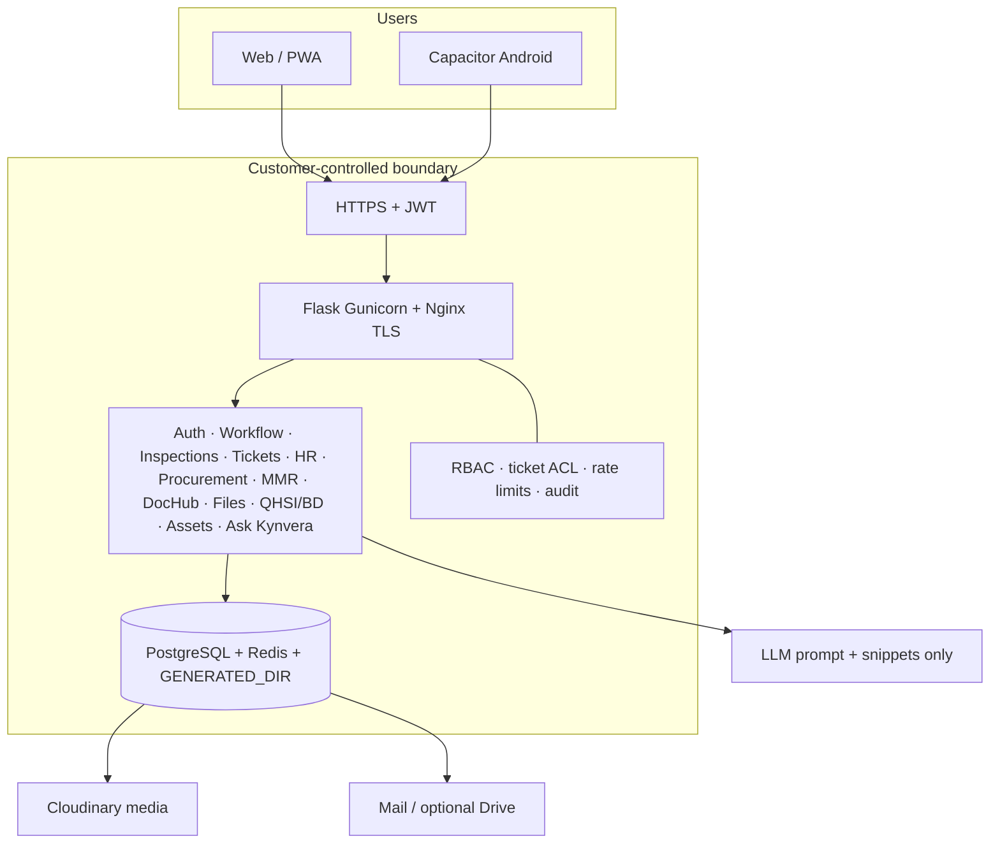
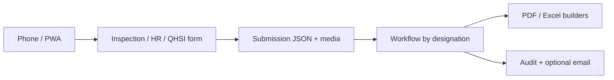
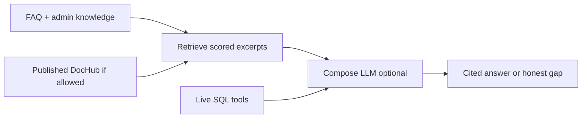
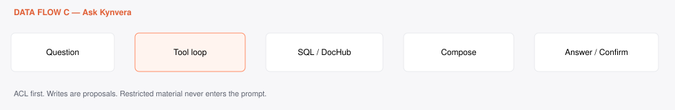
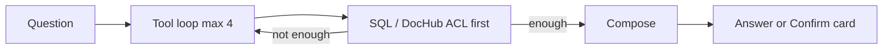
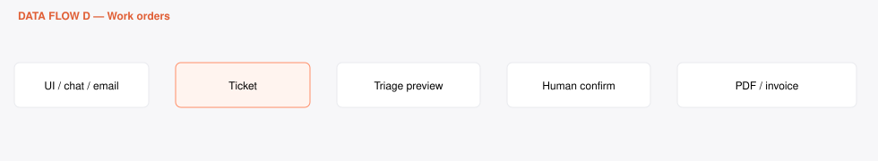
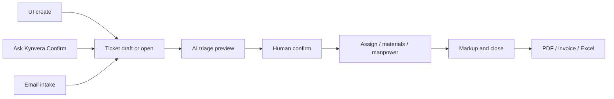
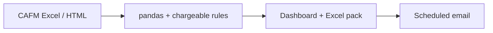
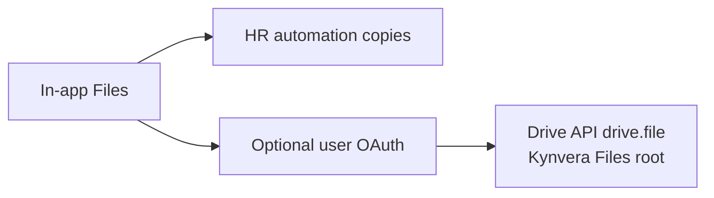

# Kynvera — Solution Architecture

**Injaaz FM Operations Platform**  
*Inside your operations stack · Grounded & auditable · Yours to operate*

**PDF (for IT):** [Architecture_Deck.pdf](Architecture_Deck.pdf)

Companion documents: [IT Clarification Answer Matrix](IT_Clarification_Answer_Matrix.md) · [Agent Connectivity, Permissions & Attributes](Agent_Connectivity_Permissions_Attributes.md)

Diagram artifacts: [architecture stack](artifacts/architecture-stack.svg) · [Ask Kynvera RAG](artifacts/ask-kynvera-rag.svg) · [ticket lifecycle](artifacts/ticket-lifecycle.svg) · [network](artifacts/network-connectivity.svg)

---

## In one line

A facilities **domain layer** on top of Injaaz’s existing work — inspections, tickets, HR, procurement, reporting — sovereign to your database, grounded by design, recoverable by design.

Regenerate PDFs and SVGs from the project root:

```bash
./venv/bin/python scripts/generate_kynvera_it_pack.py
```

---

## 1. The operating team — what each part does

Not a single chatbot. **Modules own stages of FM work**; Ask Kynvera sits across them. Every material action is supervised.

| Capability | Automates | Human owns |
|------------|-----------|------------|
| **Ask Kynvera** | Answers from live data + approved knowledge | Confirm drafts; never silent submit |
| **Inspections** | HVAC/MEP, Civil, Cleaning capture, photos, PDF/Excel | Reviewer signatures and edits |
| **Ticketing** | Work-order lifecycle, photos, costs, SLA | Assign, verify, close, markup |
| **Email intake** | Parse inbound mail → draft ticket | Convert draft to live work |
| **AI triage** | Suggested priority / SLA / technician / parts | Accept or override |
| **Assets** | Registry, QR, GIS pins, 2D twin hotspots | Master data and maintenance decisions |
| **HR** | Leave and workforce forms, trackers, letters | HR → GM approval |
| **Procurement** | Catalogues, PRs, suppliers | Threshold approvals |
| **MMR** | CAFM file ingest, chargeable rules, scheduled reports | Who receives the email |
| **DocHub / Files** | Controlled docs; optional Drive sync | Publish and folder policy |
| **QHSI / BD** | Safety/hospitality/inspections; commercial pipeline | Module-flagged users |

Operations leadership oversees the lot — **nothing client-facing or commercially binding goes out on assistant say-so**.

---

## 2. Architecture — components and integrations

You keep your tools. Kynvera is the **operations application** they already work in (web, PWA, optional Capacitor), with a **single logged egress** per approved cloud.





**Channels & interfaces:** browser, installable PWA, native Android shell, email (in/out), optional Google Drive. **Not** Teams-resident agents or WhatsApp.

**LLM — your choice:** Claude (default Haiku), OpenAI / gpt-4o-mini, or OpenAI-compatible inside your network. **Model-agnostic.** Disable LLM: full operations UI remains.

**CAFM & field:** MMR consumes **your** CAFM Excel/HTML exports. Tickets and inspections are the live field system. Write-back to third-party CAFM only via **approved** APIs after discovery.

**Knowledge:** FAQs, admin knowledge, DocHub, and live SQL — in **your** Postgres. Not a vendor-hosted corpus.

---

## 3. Data flow A — Field capture → reviewable record

From site visit to signed history.



**Accepts:** structured fields, photos, signatures, DOCX templates (HR).  
**Guarantees:** draft vs submitted; who signed; module isolation.  
**Boundary:** files to Cloudinary or your disk — not to the LLM unless a user later asks the assistant and **retrieval is allowed**.

---

## 4. Data flow B — Documents → grounded knowledge

Turning help content and DocHub into answers **without dumping the database**.



**Languages:** English operational UI; Arabic-capable document storage where files are uploaded (no claim of full Arabic OCR pipeline as a default SLA).  
**Boundary:** ingestion stays in Postgres/DocHub. Only the **compose** step may call a model.

---

## 5. Data flow C — Question → grounded answer (Ask Kynvera)





**Produces:** plain-language answers, stat cards, document links — not unattended Word proposals.  
**Grounded:** faithful to tools; no invented ticket IDs; writes are proposals.

---

## 6. Data flow D — Work orders, cost, and intake





**Built from:** your projects, properties, zones, vendors, fault catalogue — not a public rate card scrape.  
**Chargeable vs not:** MMR rules (`module_mmr`) and ticket `is_chargeable` — **people** set policy; the assistant does not rewrite rate cards.

---

## 7. Data flow E — MMR / CAFM reporting



**Boundary:** workbook stays in your app/disk. Email is an **approved** outbound path with recipients you control.

---

## 8. Data flow F — Files and optional Drive



Local Files **works with Drive off**. Sync never implies access to the user’s entire Drive.

---

## 9. Adoption — a phased path

Each phase is useful alone. No rip-and-replace of ERP.

| Phase | Focus | Why first |
|-------|--------|------------|
| **1** | Inspections + workflow + identity | Core audit trail |
| **2** | Ticketing + email intake + mobile | Live operations |
| **3** | Ask Kynvera + triage (human confirm) | Time saved without unsupervised writes |
| **4** | Assets, GIS, executive FM dashboard | Contract visibility |
| **5** | MMR, HR trackers, Files/Drive, QHSI/BD | Back office |
| **6** | Named ERP/BMS connectors | After discovery |

Change management: supervisors keep sign-off; the assistant **earns trust** before it earns write scope.

---

## 10. Data sovereignty and compliance

- **Data stays in your Postgres, disk, and contracted Cloudinary/mail accounts.** Kynvera-the-product does not need a second copy of your FM estate in a vendor RAG cloud.
- **You choose the model.** Cloud = single logged inference path. Compatible URL = your tenant. Off = zero model egress.
- **Map to UAE / client regulator expectations** (data residency of Postgres and Cloudinary region, email region) — not an abstract “secure public chatbot.”

HR and commercial sensitivity: module flags + ticket ACL + no assistant write to markup.

---

## 11. Grounded & accurate — what generic Copilot cannot do here

| # | Control | Meaning |
|---|--------|---------|
| 01 | **Source-bound** | Ticket/leave/FM numbers from SQL; policies from knowledge/DocHub |
| 02 | **Gaps flagged** | No source → say so; triage returns null technician if none fit |
| 03 | **Estimates labelled** | Asset RUL stored as `llm_estimate` until a trained model exists |
| 04 | **Human-in-the-loop** | Confirm, workflow sign, draft conversion |

Generic chat over a shared drive **will** invent SLA hours and costs. This domain layer is the other 90%: ACL, workflow, deterministic documents, confirm-before-write.

---

## 12. Where it runs — and stays yours

**Runs in your environment**

- Container (Docker multi-stage, non-root) or systemd + Gunicorn on Ubuntu
- Reference: **2–4 vCPU · 8–16 GB RAM · 100 GB+ SSD**
- GPU **not** used
- Scale: more workers, managed Postgres, Redis, dedicated job worker

**Degrades gracefully**

| Failure | Behaviour |
|---------|-----------|
| LLM unavailable | Intent/FAQ fallback or explicit unavailable; forms/tickets continue |
| Cloudinary down | New media uploads fail; DB intact |
| Mail down | UI continues; notifications delayed |
| Drive down | Local Files continues |
| Redis down | App may run; rate limits degraded |
| App VM fails | Redeploy + restore Postgres + disk |

**Yours to keep:** data, backups, code/config you are licensed to operate. No per-seat LLM platform tax from Kynvera itself (LLM **provider** usage is separate if you use a cloud model).

---

## 13. Security — how it is hardened

| Layer | What exists |
|-------|-------------|
| **Build** | Dependency pinning, secrets in env, non-root container |
| **Identity** | bcrypt, JWT + session JTI blocklist, rate-limited login |
| **Transport** | TLS at proxy; HSTS in production |
| **Headers** | nosniff, SAMEORIGIN, Referrer-Policy, Permissions-Policy, CSP Report-Only |
| **AuthZ** | Module flags, designations, ticket ACL, DocHub rows |
| **AI** | Tool ACL, pending actions, triage logs |
| **Go-live** | Ready for **your** VAPT as a production gate |

Security is a **process** — we adapt to Injaaz / client IT standards; their sign-off gates production.

---

## 14. Proof — sized and committed (honest numbers)

| Measure | What we state |
|---------|----------------|
| Quality control | Tools + confirm + labelled estimates — not a 100% marketing composite |
| Large packs | Jobs and files, not one prompt ceiling |
| GPU | N/A for default deploy |
| Concurrent users | Tens of interactive users on reference VM; re-size for heavy PDF/Excel |
| Hallucination of IDs/costs in chat | Prevented by tools + no write-without-confirm |
| Source-traceable knowledge | FAQ/DocHub titles; SQL for live facts |

Accuracy of **CAFM chargeable classification** depends on source workbook quality and your rules file. Validated in operations, not as an LLM score.

---

## 15. Build vs buy — what this actually is

| 10% | 90% |
|-----|------|
| Wiring a chat widget to an API key | Modular FM workflows, photo queues, signatures, ticket ACL, MMR rules, HR document generation, PWA/mobile, audit |

The chat is the easy part. The **operations domain layer** is what Injaaz already runs.

---

## 16. Trust boundary (summary)

| Inside the boundary | Controlled egress | Not in product |
|--------------------|-------------------|----------------|
| App, Postgres, Redis, disk, prompts, audit | LLM prompt+snippets; Cloudinary; mail; Drive `drive.file`; OSM geocode | Microsoft Graph, WhatsApp, full Gmail/Drive, silent bulk export |

---

*Kynvera · Injaaz Facilities Management · All Operations. One Platform.*
