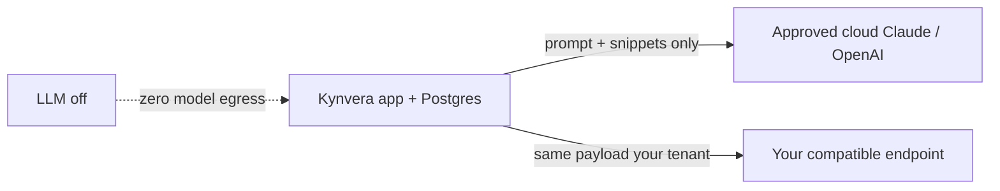
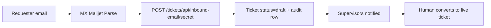

# Enterprise IT Clarification — Answer Matrix

**Kynvera · Injaaz FM Operations Platform**

**PDF (for IT):** [IT_Clarification_Answer_Matrix.pdf](IT_Clarification_Answer_Matrix.pdf)

Companion documents: [Architecture Deck](Architecture_Deck.md) · [Agent Connectivity, Permissions & Attributes](Agent_Connectivity_Permissions_Attributes.md)

---

## Executive summary

This document answers the enterprise-IT clarification questions commonly raised about **Kynvera**, Injaaz Facilities Management’s in-house operations platform.

Kynvera is a **customer-controlled facilities and operations layer** — not a generic chatbot and not a replacement for ERP, CAFM, or Microsoft 365. It covers digital inspections, work-order ticketing, HR and procurement workflows, MMR/CAFM reporting, document control, asset intelligence, and a grounded in-app assistant (**Ask Kynvera**).

It is designed so that:

- Operational records live in **your** PostgreSQL database and approved file stores.
- The assistant and AI triage **read only what the signed-in user is already allowed to see**.
- Write actions from the assistant are **proposals only** until a human confirms.
- Cloud services (LLM, email, Cloudinary, optional Google Drive) are **explicit, allow-listed egress paths** — never silent bulk export of the corpus.

---

## Answer matrix

| # | Client question | Client-ready answer |
|---|-----------------|---------------------|
| 1 | For our deployment, does any operational, HR, pricing, or commercial information leave our environment? Is the LLM on-premises, and how is it updated? | **Records stay in your database and approved stores.** The LLM is **provider-agnostic**. You choose: (a) your approved cloud model (Claude / OpenAI, current default), (b) an OpenAI-compatible endpoint you control (`ASSISTANT_LLM_BASE_URL`), or (c) disable the LLM entirely — the rest of the platform still runs. In any cloud mode, only the **user prompt plus the specific retrieved passages / tool results for that request** are sent — never the full corpus, never bulk HR/ticket dumps. Provider terms for Anthropic and OpenAI do not train foundation models on API prompts/outputs by default, subject to your agreement. See Q1 below. |
| 2 | Can you provide a complete architecture covering all components, integrations, and data flow? | **Yes** — the companion [Architecture Deck](Architecture_Deck.md) covers components, trust boundary, and data flows A–F (inspections, RAG, ticketing, MMR, email intake, Drive). |
| 3 | How does the system ensure critical clauses, SLA terms, or form fields are not lost during processing? | **Structured records, not naive chat-only chunking.** Inspections, HR, tickets, and assets are stored as typed database rows and JSON form payloads with workflow history. The assistant’s knowledge path uses FAQ / admin knowledge / DocHub retrieval with source titles; ticket and leave facts come from live SQL scoped to the user — not a single unstructured prompt. |
| 4 | How does the system prevent hallucinated costs, SLA hours, assignments, or policy answers? | **Grounded tools + confirm-before-write + labelled estimates.** Counts, dates, ticket IDs, and leave history are fetched by server-side tools. Missing sources are answered as “I don’t have that.” Ticket triage suggests priority/SLA/technician but **never auto-applies**. Asset RUL/failure estimates are stored with `method: llm_estimate` until a trained model exists. Commercial markup and selling price are set by supervisors, not invented by the assistant. |
| 5 | If users, tickets, or large inspection packs increase, how does infrastructure scale and prevent data loss? | **Staged services, not one giant prompt.** Web (Gunicorn), PostgreSQL, Redis (rate limit / queue), Cloudinary, and background report workers scale independently. Large photo packs and Excel/PDF generation run as jobs with retries. Email-intake drafts are logged to `ticket_email_intakes` even on failure. Persistent disk (`GENERATED_DIR`) is required for generated reports. |
| 6 | What are the hardware requirements: CPU, RAM, GPU? Separate server? | **Right-sized application VM; GPU is not required.** Reference: 2–4 vCPU, 8 GB RAM minimum / 16 GB recommended, 100 GB+ SSD for generated files, Ubuntu, PostgreSQL, Redis. GPU is unused — the LLM runs at the approved API endpoint (or your private compatible endpoint). See Q6. |
| 7 | What accuracy is claimed for extraction, triage, and assistant answers? How is it validated before users see it? | **We do not publish a single headline accuracy number.** Trust gates are by construction: live SQL for account facts; RAG only over approved knowledge + accessible DocHub; writes require Confirm; triage is preview-then-confirm; predictions are labelled estimates. Residual risk is **completeness** (did it fetch every relevant ticket), which humans close in review. |
| 8 | How does inbound ticket email work, and how is it secured? Is browser automation part of the product? | **Mailjet Parse API → secret webhook → draft ticket.** There is **no tender-portal browser bot** in this product. Anyone can email a dedicated intake address; the system creates `status=draft` tickets for supervisor conversion. The webhook path is secret-gated (`TICKET_INBOUND_WEBHOOK_SECRET`); wrong secret returns 404. 2FA on mailboxes remains with your email provider. |
| 9 | Which stages are fully automated and which require people? | **Automation processes and drafts; people approve, assign, sign, and close.** See Q9. |
| 10 | Does the solution integrate with Microsoft 365, Google Drive, email, and WhatsApp? | **Email (Mailjet/Brevo/SMTP) and optional Google Drive (Files) are native.** Microsoft 365 is used only if you point SMTP at it — there is **no Microsoft Graph tenant grant**. WhatsApp is **not** a product channel; field photos go through the app → Cloudinary. |
| 11 | Since Cloudinary / email / Drive are cloud services, how is sensitive site data handled? | **Each is an explicit, optional or required integration with a defined payload.** Photos and signatures go to Cloudinary (or local disk in dev). Drive uses `drive.file` only — files the app creates in a “Kynvera Files” root, not the user’s entire Drive. Highly sensitive HR/commercial files should stay in-app / DocHub unless policy permits Drive sync. |
| 12 | Can it integrate with CAFM/FM (e.g. MRI) or ERP (Dynamics, SAP)? | **Yes where you provide APIs or file exports.** MMR already ingests CAFM-style Excel/HTML and applies chargeable rules. A documented authenticated API and configurable outbound webhooks are the generic integration layer. Named ERP/BMS/SCADA connectors are scoped after discovery — we do not ship speculative MRI/SAP adapters. |
| 13 | Do any agents require a VPS or separate compute for heavy work? | **No public VPS by default.** Heavy work (OCR-like report generation, Excel, PDF, MMR) runs as in-process / worker jobs on the application host or a dedicated worker you place **inside the same boundary**. Optional Redis/RQ for queues. |
| 14 | How many concurrent users and active tickets can it support? | **Comfortable operation for a typical FM operations team (tens of concurrent interactive users) on the reference VM.** Capacity depends on report-generation load (PDF/Excel), photo volume, and LLM latency. Microservices-style scale-out: more Gunicorn workers/threads, larger Postgres, Redis, and a dedicated worker for jobs. Local load-harness exists; production sizing is confirmed in a scoped pilot. |
| 15 | Can access be restricted by module, project, ticket, and document? Can the assistant be restricted from datasets? | **Yes.** Enforcement is application RBAC (role + designation + `access_*` flags) plus per-ticket visibility, DocHub allow-list, and retrieval/tool filters so the assistant cannot see what the user cannot. Pricing/markup on tickets is a supervisor workflow field — not exposed as a chat-writable commercial store. See the connectivity document. |
| 16 | How are vulnerabilities identified and remediated? Pen tests? Certifications? | **Secure SDLC, dependency scanning, container/user hardening, security headers, rate limits.** We do not currently hand over a third-party pen-test report or ISO certificate as a default artefact. A VAPT can be run under your process before go-live; findings tracked by severity and retested. |
| 17 | What support model is provided after deployment? | **Internal product, operated by Injaaz.** Warranty, handover, and ongoing development are as contracted for the specific deployment — not a per-seat SaaS meter. The stack is designed so your IT can run it independently (Docker / systemd / OCI / Render). |
| 18 | Can the platform continue if Microsoft 365, Cloudinary, or the LLM is temporarily unavailable? | **Yes, with graceful degradation.** Core login, forms, tickets, and workflow run as long as the app + PostgreSQL are up. LLM down → assistant falls back to intent/FAQ replies or “LLM unavailable.” Cloudinary down → new uploads fail; existing DB records remain. Email down → notifications queue/fail visibly; users still work in the UI. Drive down → local Files still works. |
| 19 | What business continuity and disaster recovery measures are in place? | **PostgreSQL backups, versioned app deploy, `GENERATED_DIR` on persistent disk, documented restore.** Optional OCI snapshots / provider PITR. See Q19–22. |
| 20 | Who owns backups of the “AI memory”? | **You do.** Assistant knowledge (FAQs, admin knowledge records), pending actions, triage logs, and audit logs are in PostgreSQL. There is **no fine-tuned copy of your data** at the model provider. |
| 21 | If the application server fails, how do we restore configuration and “trained state”? | **Stateless app + restore Postgres (+ disk + secrets).** Agent logic is versioned code and prompts in the repo — not model weights. Redeploy the container/VM and restore the database. |
| 22 | What standard server backup routines should be followed? | **Follow your IT standard:** `pg_dump` / provider snapshots of Postgres; snapshot `GENERATED_DIR`; Cloudinary remains the media source of truth in production; secrets in the host secret store — never in git. |
| 23 | Is this an end-to-end bid-to-finance system, or operations plus integrations? | **This product is the FM operations backbone** (inspections, tickets, HR, procurement, BD, QHSI, MMR, files, assets). It complements ERP/finance/CAFM rather than replacing them. Broader AI/ERP programmes are a separate discovery. |
| 24 | Does the solution require Global Administrator access to Microsoft 365? | **No. We never request Microsoft Graph or Global Admin.** Optional Google Drive uses a **user-consented OAuth app** with `drive.file` + email/openid — not domain-wide Drive access. In-app “admin” is our own RBAC role for Kynvera users. |
| 25 | What exactly does the assistant touch? | **Only tools listed in the connectivity matrix**, always as the signed-in user. Reads: profile, leave, tickets, pending forms, DocHub, FM stats (if `access_ticketing`). Writes: **propose** ticket draft or leave draft — Confirm required. It does not approve forms, close tickets, send email, or touch Drive/payroll. |
| 26 | How does the system know what each user may access? | **Your Kynvera user record** — `role`, `designation`, per-module `access_*` flags, ticket project roster, DocHub access row. JWT identity is the user id; tools never accept a client-supplied `user_id` to impersonate someone else (admins may look up another profile by name only). |
| 27 | Can pricing / commercial data be restricted? | **Yes.** Ticket markup, selling price, and chargeable flags are supervisor/ops workflow fields, not assistant-writable. MMR chargeable analytics require `access_report_generation`. Procurement pricing requires `access_procurement_module`. The assistant has **no cost-estimator write tool**. |

---

## Q1 — Data boundary and LLM modes

In a private / customer-controlled deployment, **operational records, embeddings (if any), indexes, audit logs, and generated files remain in your infrastructure**.

Kynvera is **LLM-agnostic**:

| Mode | What leaves the boundary | Who updates the model |
|------|---------------------------|------------------------|
| **Approved cloud** (Claude via Anthropic, or OpenAI) | Prompt + retrieved passages / tool JSON for that turn only | Provider, under your API agreement |
| **Corporate / compatible endpoint** (`ASSISTANT_LLM_BASE_URL`) | Same payload, to **your** endpoint (e.g. Azure OpenAI, vLLM, LiteLLM) | You / your vendor |
| **LLM off** (`ASSISTANT_LLM_ENABLED=false` or no key) | Nothing to a model | N/A — forms, tickets, workflow unchanged |

**What is never sent in bulk:** HR tracker spreadsheets, full ticket tables, CAFM workbooks, password hashes, JWT secrets.

**Three update streams (separate):**

1. **Model** — provider or your packaged open-weight image; promoted after your change control.
2. **Assistant skills / prompts / tools** — versioned in application releases; no silent production prompt edits.
3. **Knowledge** — FAQs, admin-uploaded knowledge, DocHub, and live SQL — refreshed inside your database as users work.

---

## Q3 — Completeness of operational and knowledge data

Kynvera does **not** rely on splitting a 6,000-page RFP into a single chat context. Completeness is protected by record type:

| Data class | How it is stored | Completeness control |
|-----------|------------------|----------------------|
| Inspection / HR forms | `Submission` + JSON `form_data` + workflow events | Workflow status, signatures, history |
| Work orders | `Ticket` rows, images, materials, manpower, SLA | Status machine; draft vs live separation |
| Assets | `Asset` registry, QR, lat/lng, health | CRUD + ticket link |
| Policies / how-to | FAQ JSON + admin knowledge + DocHub | Retrieval with source title; honest “don’t know” |
| CAFM / MMR | Uploaded workbooks processed by pandas rules | Chargeable-rule checks; scheduled email |

Critical commercial or SLA text on a **form** is a field, not a chunk that can silently drop. Assistant answers that need numbers **must call a tool**.

---

## Q4 — Anti-hallucination controls (three layers)

1. **At retrieval / tools** — SQL and DocHub queries are scoped to the JWT user. Restricted modules return `{ allowed: false }`; the model is instructed to say the user lacks access, not to invent counts.
2. **At generation** — system rules: never invent ticket IDs, dates, policies, or URLs; gaps are explicit; no markdown-fabrication of sources.
3. **At action** — `propose_create_ticket` / `propose_leave_draft` store an `AssistantPendingAction` (15-minute TTL). `/api/assistant/confirm` is the only write. Triage is `triage-preview` then human `triage-confirm`. Asset predictions are labelled `llm_estimate`.

Material outputs that leave the organisation (client PDFs, invoices, MMR emails) are generated by **deterministic report builders** (ReportLab, openpyxl), not free-form LLM prose.

---

## Q6 — Reference infrastructure

| Component | Reference sizing | Notes |
|-----------|------------------|-------|
| Application | 2–4 vCPU, 8–16 GB RAM | Gunicorn, 1+ worker, 4 threads; raise workers under report load |
| PostgreSQL | Managed or co-located | Production required; SQLite is dev-only |
| Redis | 256 MB+ | Rate limits; optional RQ |
| Disk | 100 GB+ SSD (`GENERATED_DIR`) | MMR, PDFs, uploads if not all on Cloudinary |
| GPU | **Not required** | No local embedding GPU in the default stack |
| OS | Ubuntu 22.04/24.04 | Docker non-root user `injaaz` |

This is sufficient for the application layer, ingestion of CAFM files, RAG search over knowledge, users, and audit. Faster LLM responses are a **provider/model choice**, not a GPU on the app VM.

---

## Q8 — Email intake vs portal automation

Kynvera does **not** include a Browser-AI tender scout.

**Inbound service tickets**

2FA, mailbox credentials, and anti-spoofing (SPF/DKIM/DMARC) remain on **your** mail domain. The application never stores mailbox passwords for scraping.

---

## Q9 — Automated vs human

**Automated (routine):** form capture, photo upload, PDF/Excel generation, workflow routing, notifications, MMR schedule, knowledge retrieval, triage *suggestions*, draft-ticket parsing from email, Drive sync of files the user already saved in Files.

**Human required:** workflow approve/reject/sign; converting email drafts; applying triage; setting markup and closing tickets; HR/GM sign-off; bid/commercial decisions; any client-facing wording; Drive OAuth consent.

---

## Q16 — Security evidence (honest)

Current evidence we can show from the product:

- Password hashing (bcrypt); JWT access/refresh with session JTI revocation
- Optional Redis rate limits (login 5/min; default API budget)
- CSRF on applicable form routes; production cookie flags
- Security headers: `X-Content-Type-Options`, `X-Frame-Options`, `Referrer-Policy`, `Permissions-Policy`, HSTS in production, CSP Report-Only (enforce via `CSP_ENFORCE`)
- Secrets via environment — not committed
- Docker non-root runtime
- Audit log model for login and material workflow actions
- Assistant confirm-before-write and tool scoping

**Not claimed as default:** third-party pen-test report, SOC 2 / ISO 27001 certificate, Entra SSO, TOTP MFA. These can be added as deployment gates.

---

## Q19–22 — Backup and restore (practical)

| What | Owner | Typical method |
|------|--------|----------------|
| PostgreSQL (users, tickets, forms, knowledge, audit, pending actions) | Customer / hosting | Provider PITR + `pg_dump`; Admin → Database download is convenience only |
| Generated reports / local uploads | Customer | Persistent volume / OCI block volume |
| Images in production | Cloudinary | Cloudinary redundancy + your account |
| Application + prompts | Git release | Redeploy image/tag |
| Secrets | Customer IT | Host secret store |

There is **no separate “trained model” of Injaaz data**. Restore = app revision + database + disk + env.

---

## How to use this pack with IT

1. Walk [Architecture Deck](Architecture_Deck.md) for trust boundary and data flows.
2. Review [Agent Connectivity](Agent_Connectivity_Permissions_Attributes.md) for tools, OAuth scopes, and ports.
3. Confirm LLM mode, Cloudinary, mail, and whether Google Drive is in scope.
4. Treat VAPT as a production gate if your policy requires it.

---

*Kynvera · Injaaz Facilities Management · All Operations. One Platform.*
