# Kynvera Operations — Module Architecture

**Kynvera Operations Application**  
How each module is designed, how data moves, and how work stays in a single stream.

Companion documents:

- [Overview](Kynvera_Operations_Overview.md) — what the application is and what each module does
- [Security, Scale & Continuity](Kynvera_Operations_Security_Scale_Continuity.md) — security, growth, backup, and client questions

This document is for stakeholders who need to see **structure**, not only features: where a request starts, who touches it, what is stored, and how modules stay independent without becoming silos.

---

## 1. How the platform is put together

Kynvera Operations is a **modular monolith**.

- **One** web application, **one** sign-in, **one** PostgreSQL database in production.
- **Many** modules, each with its own routes, screens, and rules.
- **Shared** identity, workflow helpers, file storage, email, and audit.

That shape is deliberate. Operations work is cross-cutting (a ticket can consume materials; an inspection produces a PDF; HR exports land in Files). Separate products would force copy-paste and broken permissions. Separate *code folders* keep each domain maintainable while still sharing the spine.

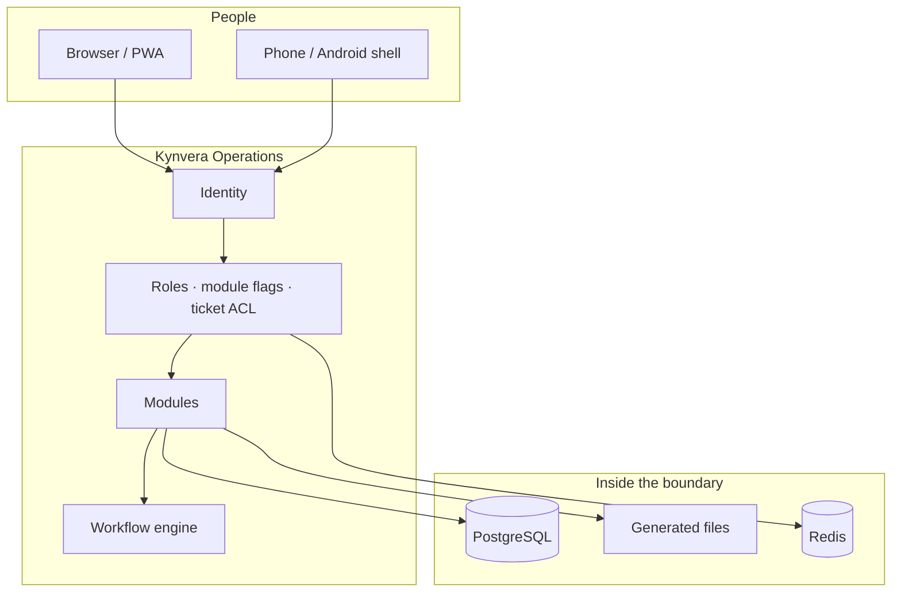

**Runtime (plain language):** the application server handles pages and APIs; PostgreSQL holds records; Redis helps with rate limits and optional background queues; photos in production go to a contracted media host; generated Excel/PDF live on persistent disk.

If one optional module fails to load, the rest of the application still starts. That is a **fail-soft** design for operations continuity, not a reason to ignore a broken module.

---

## 2. Shared architectural patterns

Every module reuses the same few patterns so the product feels like one system.

| Pattern | Why it exists | How it shows up |
|---------|----------------|-----------------|
| **Blueprint per domain** | Isolate HVAC from HR from tickets | Each module has its own URL prefix and screens |
| **JWT identity** | Know *who* on every request | Access + refresh tokens; browser cookies for page navigation |
| **RBAC + flags** | Least privilege | Role, designation, `access_*` flags; admins bypass module gates |
| **Object ACL** | Module access ≠ see-all | Tickets: reporter / assignee / team / project. DocHub: per-user row |
| **Draft vs live** | Nothing accidental goes out | Inspection drafts, ticket drafts from email, assistant **proposals** |
| **Human gate** | Automation drafts; people decide | Workflow sign, triage confirm, GM approve, Drive consent |
| **Deterministic documents** | Client packs must not “hallucinate” | PDF/Excel/DOCX builders, not free-form model prose |
| **JSON form payload** | Forms change without a new table per field | `form_data` on submissions, plus typed columns where needed |
| **Background jobs** | Heavy PDF/Excel must not freeze the phone | Worker / thread pool; status polling |
| **Audit + notifications** | Who did what, who must act next | Audit log, in-app notifications, optional email |

These patterns are the **streamline**: capture → store → route → sign → file → notify. Modules differ in *what* they capture, not in *whether* that stream exists.

---

## 3. Identity and administration

### Purpose in the architecture

Identity is the spine. No module trusts a client-supplied “act as user X.” The signed-in identity is the only identity tools and routes use.

### Structure

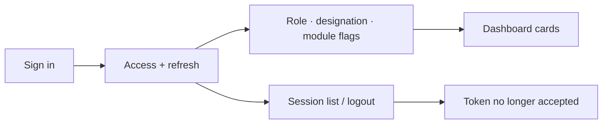

- Passwords are hashed (bcrypt). Secrets live in environment variables, not in the repository.
- Logout and session revocation put the token identifier on a blocklist so a stolen cookie cannot linger after sign-out.
- Administration is the only place that **grants** module flags and designations. Revoking a flag stops new UI and API access for that module immediately.

### Streamline

1. Person signs in.
2. Dashboard renders only permitted modules.
3. Each subsequent request carries the same identity.
4. Admin changes take effect on the next request — no separate “sync users to five systems.”

---

## 4. Workflow (shared review stream)

### Purpose

Inspections (and related submissions) must not depend on forwarding an email. Workflow is a **state machine** with a queue for the next actor.

### Structure

Typical inspection path (exact stages depend on designation and module):

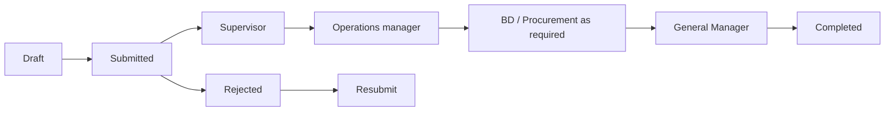

Records store both a **file status** (draft / submitted / processing) and a **workflow status** (who must act). History is kept on the submission so review is auditable.

### Streamline

1. Site user saves draft or submits.
2. Pending Review lists items for the current designation.
3. Reviewer opens the same form (not a screenshot in email), edits if allowed, signs, approves or rejects.
4. Notifications fire for the next person.
5. Completed packs (PDF/Excel) remain downloadable against the record.

**Isolation:** HR has its **own** chain (HR → GM) so workforce forms do not clog the inspection queue. Tickets have their **own** status machine. Workflow is shared *technology*, not one undifferentiated pile of “approvals.”

---

## 5. Inspections (HVAC & MEP, Civil, Cleaning)

### Purpose

Turn a site visit into a **reviewable, signed record** with photos and a generated pack.

### Architecture

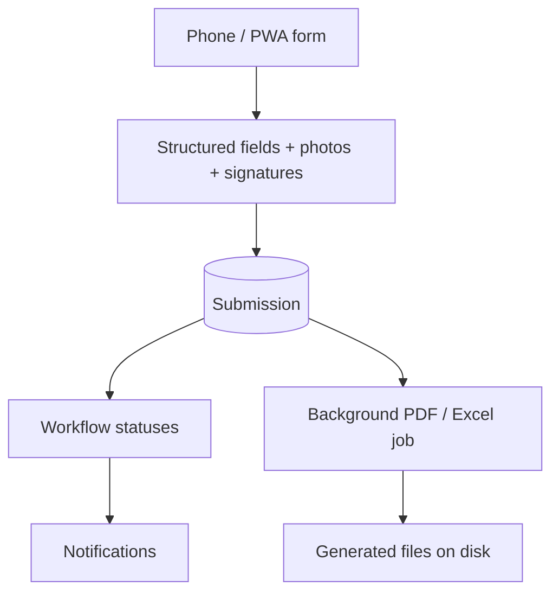

- Catalogues (dropdowns, item lists) live as structured data so trades stay consistent.
- Photos upload to Cloudinary in production (or local disk in development).
- Report generation is **asynchronous**: submit returns; the user polls or downloads when the job completes.
- The same submission is what reviewers open — no parallel “Word version” that can drift.

### Streamline

Capture on site → draft or submit → queue → sign → pack on file. Module isolation is by **trade catalogue and access flag**, not by a separate product.

---

## 6. Ticketing

### Purpose

Live work orders with location, cost, people, and a strict visibility model.

### Architecture

Three intakes, one ticket record:

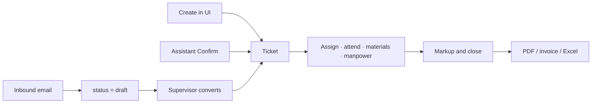

**Visibility** is computed per ticket (reporter, assignee, technician, supervisor, project roster). Having the ticketing module is not a licence to read every site’s work.

**Triage** is a side path: preview suggestions, then a human confirm endpoint. Suggestions are not auto-applied.

**Email intake** hits a secret webhook path. Failures still leave an intake log so mail is not silently lost. Drafts never become live work without a person.

### Streamline

Intake → (draft if email) → assign → execute (photos, materials, manpower) → verify → close with commercial fields set by supervisors → documents. SLA and chargeable flags are **fields on the ticket**, not chat guesses.

---

## 7. Assets

### Purpose

Master data for equipment, findable in the field (QR) and on a plan (map / twin).

### Architecture

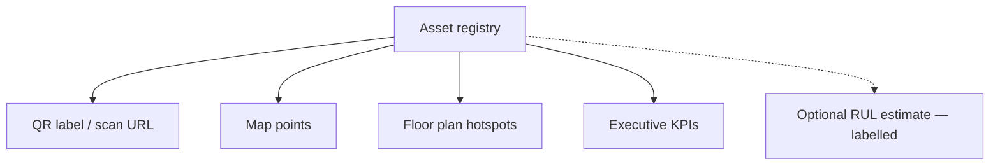

Assets are first-class rows (code, location, health), not files in a folder. Scan URLs open the asset in the application under the same sign-in rules. Predictions, when used, are stored as **estimates** until a trained model exists — the architecture refuses to present them as certified remaining life.

### Streamline

Register → tag → find on site or on plan → link to tickets / maintenance decisions. Integration API keys and webhooks are the **future connector** surface, not silent export.

---

## 8. Human resources

### Purpose

Workforce processes that used to be paper / Word, plus operational trackers, on a dedicated approval chain.

### Architecture

Two layers in one module:

| Layer | What it is | Storage |
|-------|------------|---------|
| **Forms** | Leave, commencement, visa, appraisal, … | Submission + JSON payload + signatures |
| **Trackers** | Leave board, manpower, hiring documents, offer letters | Dedicated tables / workbooks export |

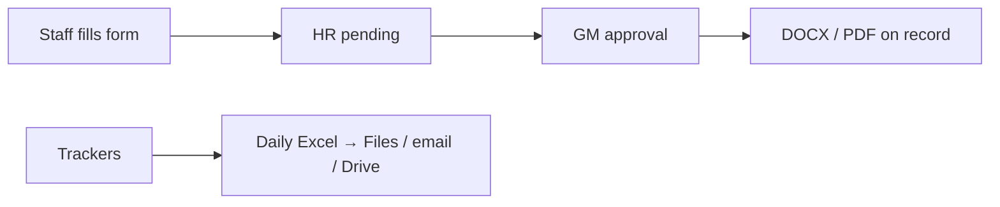

**Why a separate chain from inspection workflow:** HR is confidential and GM-gated. Mixing it into the site-inspection queue would leak context and slow both processes.

Replacement and management-chain sign-off exist so leave cover does not stall a form: the architecture models **who may sign instead**, with an activity feed.

Document generation is dual: **DOCX from official templates** (placeholders) and **PDF from layout builders** — both deterministic.

### Streamline

Request → HR → GM → filed document. Trackers are the live boards; Automations snapshot them daily so the organisation is not one laptop away from losing the only copy.

---

## 9. Procurement

### Purpose

Stock and purchasing as **records with states**, not a spreadsheet that cannot enforce a threshold.

### Architecture

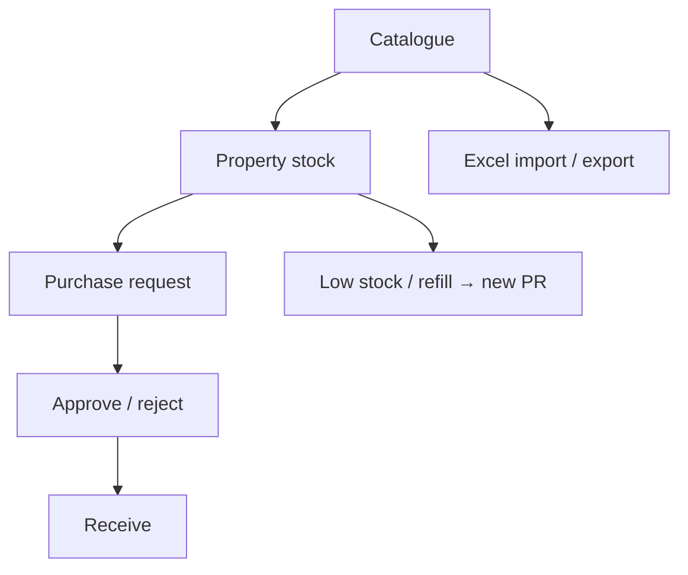

Purchase requests have a status path (submitted through received / closed). Stock can move between properties without inventing a second catalogue. Excel is an **interchange** format, not the system of record.

### Streamline

Know the material → see stock on the property → raise PR → approve → receive → log usage. Daily export lands in Files so procurement has the same backup habit as HR.

---

## 10. QHSI

### Purpose

Quality, hospitality, and safety as a **hub** that reuses inspection catalogues rather than inventing a fourth trade form from scratch.

### Architecture

- **Inspections** reuse HVAC / Civil / Cleaning catalogues so QHSI and site inspection speak the same language of assets and checks.
- **Staff compliance** is importable (Excel template) and submittable as its own record type (kit / PPE items).
- **Training** is a simple register with API create / update / delete.

QHSI is flagged separately (`access_qhsi`) so safety officers are not automatically given HR or commercial modules.

### Streamline

Import or capture compliance → inspect against the same trade catalogues → keep training current. One identity, one audit approach, different flag.

---

## 11. Report generation (MMR)

### Purpose

CAFM files in; chargeable analytics and scheduled packs out — **rules in code and policy**, not a model rewriting the rate card.

### Architecture

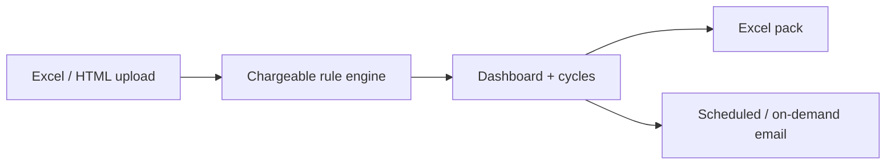

The chargeable resolver reads CAFM columns (service group, client, contract, base unit, space, work description, …) in a **fixed order**. First matching rule wins. That is how two reports of the same file stay consistent.

Scheduling (default **Asia/Dubai**) is configuration: recipients, pause/resume, presets. The workbook stays in the application / disk; email is an approved outbound path.

### Streamline

Upload → classify → review dashboard → download or let the schedule send. People own **who receives** the mail. The assistant cannot rewrite chargeable rules.

---

## 12. Business development

### Purpose

Commercial pipeline and **controlled outbound email** of operational packs.

### Architecture

- Pipeline entities (accounts, status, owners) live in the database with BD / sales-manager / quotations flags.
- The email module attaches **already generated** files (and optional cloud files), to groups, with optional automations and a run history.

This is architected as **operations-adjacent commercial**, not as a full ERP. Quotations and client mail are human-triggered.

### Streamline

Opportunity on the pipeline → pack from approved records → send via the email module. No silent mail from the assistant.

---

## 13. DocHub

### Purpose

Published knowledge and controlled files **inside** the same permission model the assistant will later read.

### Architecture

Documents are rows with access policy (default open to signed-in authorised users, or a per-user allow row). Retrieval for the assistant is **the same ACL**: if the person cannot open the document in DocHub, the assistant cannot see it either.

### Streamline

Publish → grant access → staff (and assistant, if allowed) read from one library. No second “AI corpus” copy of the estate.

---

## 14. Files and optional Drive

### Purpose

A system of record for **generated and uploaded files** that does not depend on Google being available.

### Architecture

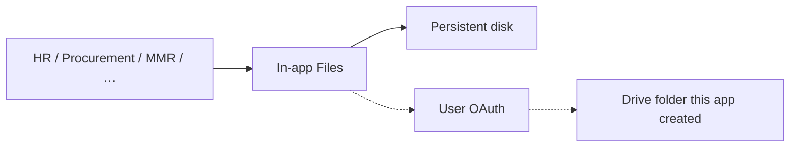

Local Files **works with Drive off**. Sync uses a narrow Drive scope (`drive.file`): files the application created under a dedicated root — not domain-wide Drive. Each person connects **their** Google account.

### Streamline

Module export → Files folder → optional Drive. HR automations follow this path every day.

---

## 15. Automations

### Purpose

Make backup and export a **schedule**, not a memory.

### Architecture

A job catalogue (implemented vs linked vs coming soon) with per-job recipients, time (Asia/Dubai), and run history. Jobs run as server work using **application configuration**, not a user’s Google token — except Drive sync, which uses the connecting user’s stored consent.

Implemented jobs snapshot HR trackers, procurement materials, devices, and technicians. MMR’s daily Excel is **linked** here so operators see it, but Report Generation remains the owner of that schedule.

### Streamline

Configure once → nightly run → Files + email (+ Drive if connected) → run log. If mail fails, the UI still shows the attempt; Files can still hold the workbook.

---

## 16. In-app assistant

### Purpose

A **read path with a confirm-before-write path**, sitting *across* modules, never beside them as a second system.

### Architecture

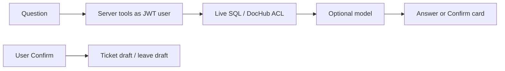

- Tools ignore any client-supplied user id.
- Writes insert a **pending action** with a short time-to-live; only Confirm persists.
- Model mode is a **deployment choice**: approved cloud, organisation-hosted compatible endpoint, or off.
- When the model is down, forms and tickets continue.

### Streamline

Ask → fetch what this user may see → answer with sources or a gap → if a write is needed, show Confirm. That is the same least-privilege model as the UI, applied to chat.

---

## 17. Devices

### Purpose

Operational inventory of hardware assigned to people, on the same admin surface as users.

### Architecture

Device rows (status, assignee) plus a daily Excel job. This is not a full MDM product; it is **operations visibility** of who holds which device, stored next to the user directory.

---

## 18. End-to-end streams (how modules cooperate)

The streamline the organisation should recognise:

| Stream | Modules that touch it | Guarantee |
|--------|------------------------|-----------|
| **Site inspection to signed pack** | Inspection → Workflow → Files / email | One submission, one history, generated PDF/Excel |
| **Fault to closed work order** | Ticketing (± email, ± assistant, ± triage) → Procurement materials as needed | Draft vs live; ACL; human close |
| **People request to filed HR form** | HR forms → HR → GM → DOCX/PDF | Separate from inspection queue |
| **Workforce boards to nightly copy** | HR trackers → Automations → Files / mail / Drive | Not a single laptop as source of truth |
| **CAFM file to billed view** | MMR rules → dashboard → scheduled mail | Same rules every cycle |
| **Question to cited answer** | Assistant tools → SQL / DocHub | No invented ticket IDs; no silent submit |

---

## 19. What this architecture is not

- Not a replacement for ERP, payroll, or CAFM as the **financial** system of record.
- Not a Microsoft 365 tenant agent and not WhatsApp.
- Not unsupervised AI writing commercial numbers into live tickets.
- Not a microservices mesh. Scale is **more workers, larger Postgres, Redis, a job worker** — see the continuity document.

---

*Kynvera Operations — Operations Application*  
*August 2026*
